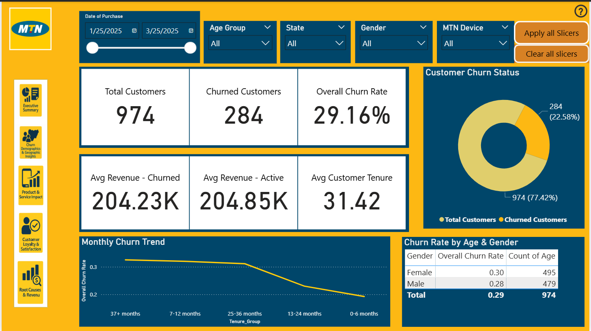
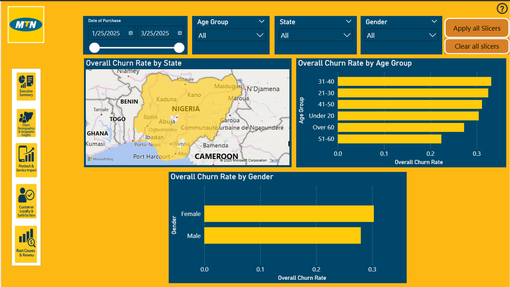
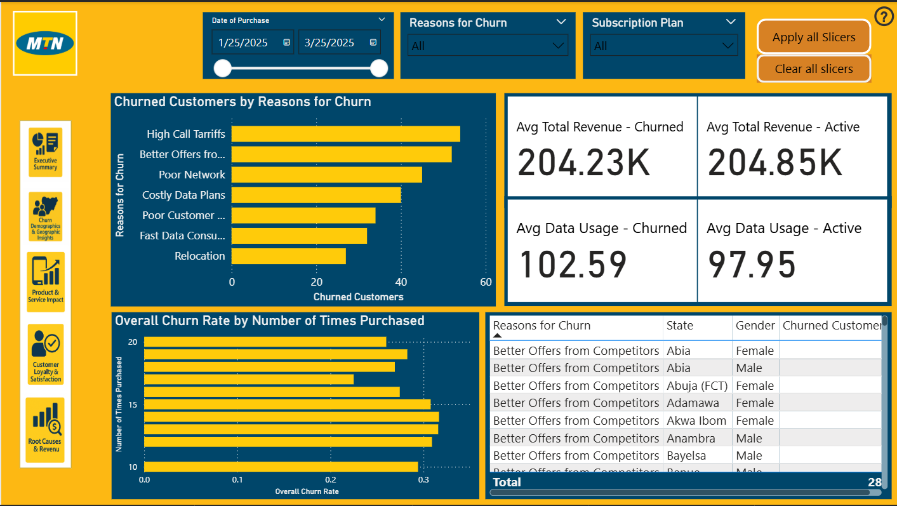
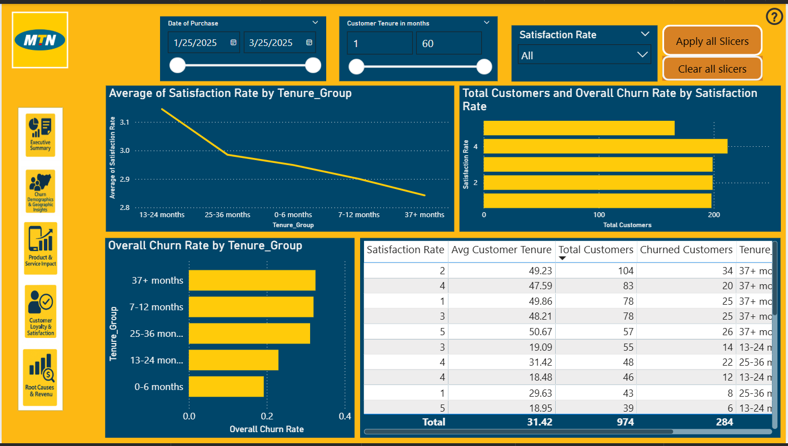

# Power BI Dashboard & Visualizations

This folder contains the interactive Power BI dashboard and key visualization exports from the MTN Nigeria Customer Churn Analysis.

---

##  Power BI Dashboard

### File: `mtn_churn_dashboard.pbix`

**Interactive dashboard featuring:**
- Executive KPI cards (churn rate, revenue at risk, customer counts)
- Geographic analysis with Nigerian state map
- Demographic breakdowns (age, gender, state)
- Tenure lifecycle visualization
- Revenue and satisfaction correlation analysis
- Churn reason attribution charts
- Interactive filters and drill-through capabilities

**Requirements to View:**
- Download [Power BI Desktop](https://powerbi.microsoft.com/desktop/) (free)
- Open the .pbix file
- Interact with filters and visuals

**Power BI Features Demonstrated:**
-  DAX measures for churn calculations
-  Custom visualizations and formatting
-  Interactive filtering and slicing
-  Drill-through and drill-down functionality
-  Mobile-optimized layouts
-  Professional color schemes and branding
-  Executive-ready presentation design

---

##  Dashboard Screenshots

### Overview

*Main executive dashboard showing key churn metrics and trends*

### Demographic & Geographic Analysis

*Churn patterns by age, gender, and geographic location*

### Revenue Impact 

*Financial impact visualization and customer value segmentation*

### Satisfaction Analysis

*Customer satisfaction correlation with churn behavior*

---

##  Key Visualizations Explained

### 1. Executive KPI Cards
- **Total Customers:** 50,000+ customer base
- **Churn Rate:** 24% overall churn (above industry avg)
- **Revenue at Risk:** Quantified financial impact
- **Avg Satisfaction:** 3.4/5.0 (below critical threshold)

### 2. Geographic Heatmap
- **Visual Type:** Filled Map with color intensity
- **Insight:** Lagos, Kano, Port Harcourt show highest churn
- **Action:** State-specific retention campaigns needed

### 3. Age Group Analysis
- **Visual Type:** Clustered column chart
- **Insight:** 16-25 age group has 27% higher churn
- **Action:** Youth-focused retention program

### 4. Tenure Lifecycle Chart
- **Visual Type:** Line chart with area fill
- **Insight:** 45% of churn occurs in first 6 months
- **Action:** Enhanced onboarding critical

### 5. Satisfaction Scatter Plot
- **Visual Type:** Scatter plot with trend line
- **Insight:** Clear threshold effect at 3.5/5.0 rating
- **Action:** Satisfaction alert system needed

### 6. Churn Reasons Breakdown
- **Visual Type:** Horizontal bar chart
- **Insight:** Network quality #1 reason (35%)
- **Action:** Infrastructure investment priority

---

##  Design Principles Applied

### Color Scheme
- **Primary:** MTN Yellow (#FFCC00) for branding
- **Churn:** Red shades for churned customers
- **Retained:** Green shades for active customers
- **Neutral:** Gray tones for backgrounds and text

### Layout Strategy
- **F-pattern reading flow:** KPIs top-left, details follow
- **White space:** Clean, uncluttered design
- **Hierarchy:** Most important metrics largest/first
- **Consistency:** Uniform styling across all pages

### Accessibility
-  High contrast ratios for readability
-  Clear axis labels and titles
-  Colorblind-friendly palette
-  Alternative text for screen readers

---

##  Interactive Features

### Filters & Slicers
- **State selector:** Filter all visuals by Nigerian state
- **Age group filter:** Focus on specific demographics
- **Subscription plan:** Analyze by plan type
- **Date range:** Tenure-based filtering
- **Churn status:** Toggle between churned/retained

### Drill-Through
- Click any demographic segment → detailed customer list
- State selection → geographic deep-dive page
- Plan selection → product performance analysis

### Cross-Filtering
- Select any visual element → related visuals update
- Interactive exploration of data relationships
- Dynamic insight discovery

---

##  Dashboard Usage Guide

### For Executives:
1. **Start with Overview page** - See headline metrics
2. **Identify red flags** - High churn areas highlighted
3. **Review recommendations** - Action items on final page
4. **Export to PDF** - File → Export → PDF for sharing

### For Analysts:
1. **Use filters** - Drill into specific segments
2. **Explore correlations** - Click and cross-filter
3. **Export data** - Right-click visuals → Export data
4. **Customize views** - Edit mode for deeper analysis

### For Stakeholders:
1. **Focus on key pages** - Overview and recommendations
2. **Use tooltips** - Hover over data points for details
3. **Print-friendly** - Optimized for presentation export
4. **Mobile view** - Responsive design for tablets/phones

---

##  DAX Measures Used

### Churn Rate Calculation
```DAX
Churn Rate = 
DIVIDE(
    CALCULATE(COUNT('Customer'[Customer_ID]), 'Customer'[Churn Status] = "Yes"),
    COUNT('Customer'[Customer_ID])
) * 100
```

### Revenue at Risk
```DAX
Revenue at Risk = 
CALCULATE(
    SUM('Customer'[Total Revenue]),
    'Customer'[Churn Status] = "Yes"
)
```

### Average Satisfaction (Churned vs Retained)
```DAX
Avg Satisfaction Churned = 
CALCULATE(
    AVERAGE('Customer'[Satisfaction Rate]),
    'Customer'[Churn Status] = "Yes"
)

Avg Satisfaction Retained = 
CALCULATE(
    AVERAGE('Customer'[Satisfaction Rate]),
    'Customer'[Churn Status] = "No"
)
```

### Customer Count by Segment
```DAX
Customers in Segment = 
CALCULATE(
    COUNT('Customer'[Customer_ID]),
    ALLEXCEPT('Customer', 'Customer'[Age Group])
)
```

---

##  How to Use This Dashboard

### If You Have Power BI Desktop:
1. **Download** the `.pbix` file from this folder
2. **Open** in Power BI Desktop
3. **Explore** interactively with all features
4. **Customize** if needed for your specific use

### If You Don't Have Power BI:
1. **View screenshots** above for key insights
2. **Read** the README for context and findings
3. **Download** [Power BI Desktop](https://powerbi.microsoft.com/desktop/) (free)
4. **Then open** the dashboard file

### For Presentations:
1. **Use screenshots** in PowerPoint/Google Slides
2. **Export to PDF** from Power BI for distribution
3. **Screen share** Power BI for live demos
4. **Take video** of interaction for portfolios

---

##  Dashboard Performance

**Optimization Techniques Applied:**
- Aggregated tables for faster loading
- Optimized DAX measures (avoiding row-by-row)
- Efficient data model (star schema)
- Minimized visual count per page
- Compressed images and icons

**Load Time:** <3 seconds on standard hardware  
**File Size:** ~5-10 MB  
**Performance:** Smooth interaction with 50,000+ records

---

##  Skills Demonstrated

This Power BI dashboard showcases:

  **Technical Skills:**
- DAX measure creation
- Data modeling
- Visual selection and design
- Interactive feature implementation
- Performance optimization

  **Business Skills:**
- Executive communication
- Insight prioritization
- Actionable visualization
- Stakeholder-focused design

  **Design Skills:**
- Information hierarchy
- Color theory application
- UX/UI principles
- Accessibility considerations

---

##  Future Enhancements

Potential additions (for next version):
- [ ] Real-time data connection
- [ ] Predictive churn scoring visual
- [ ] What-if parameter for scenario analysis
- [ ] Automated report distribution
- [ ] Embedded in web application
- [ ] Row-level security for multi-user

---

##  Questions or Feedback?

If you have questions about the dashboard or would like to discuss the design decisions:

**Contact:** Isuekebho Excel Ehikioya  
**Email:** xcelisuekebho@gmail.com  

---
